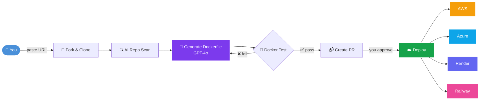
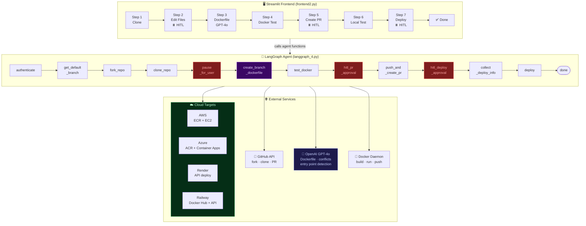
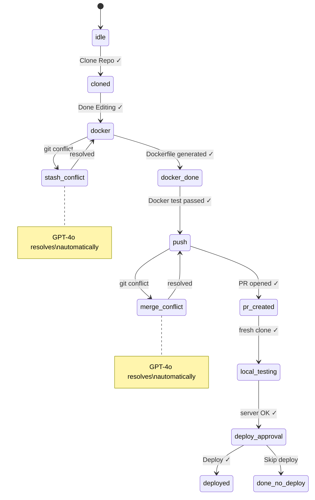
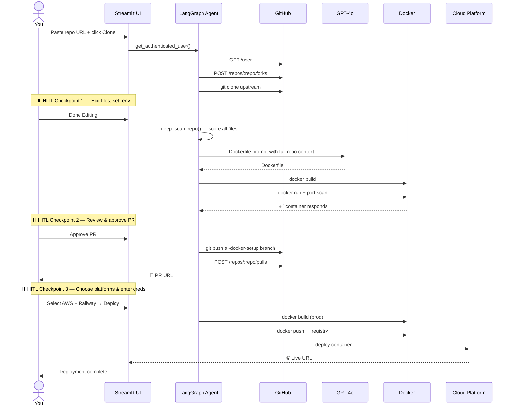

<div align="center">

# 🚀 AI DevOps Agent

**From GitHub URL → Running Cloud App in minutes — fully automated by AI**

[](https://python.org)
[](https://streamlit.io)
[](https://langchain-ai.github.io/langgraph/)
[](https://openai.com)
[](https://docker.com)
[](LICENSE)

<br/>

> Paste a GitHub URL. The AI handles the rest — Dockerfile, Docker test, PR, and cloud deploy.

<br/>

```
GitHub Repo URL  ──▶  Fork  ──▶  Scan  ──▶  Dockerfile (GPT-4o)  ──▶  Docker Test  ──▶  PR  ──▶  Deploy
```

</div>

---

## 📋 Table of Contents

- [How it works](#-how-it-works)
- [Architecture](#-architecture)
- [Features](#-features)
- [Supported Platforms](#-supported-platforms)
- [Quick Start](#-quick-start)
- [Configuration](#-configuration)
- [Workflow Walkthrough](#-workflow-walkthrough)
- [Supported Frameworks](#-supported-frameworks)
- [Security](#-security)

---

## ✨ How it works



**Three human-in-the-loop checkpoints** — you stay in control at every critical step:

| Checkpoint | When | What you decide |
|:---:|---|---|
| ⏸️ **1** | After clone | Edit source files, add env vars, give hints to the AI |
| ⏸️ **2** | After Docker test | Review the generated Dockerfile, approve the PR |
| ⏸️ **3** | Before deploy | Choose which cloud platforms and enter credentials |

---

## 🏗️ Architecture



### State Machine — session is always resumable



---

## ⚡ Features

<table>
<tr>
<td width="50%">

### 🧠 AI Dockerfile Generation
- Full repo deep-scan before generating
- Detects language, framework, port, entry point
- Handles GPU/CUDA, Conda, ML model files
- Generates `requirements.txt` if missing
- Accepts your custom hints as context

</td>
<td width="50%">

### 🔧 Git Conflict Resolution
- Stash and merge conflicts auto-resolved by GPT-4o
- Per-file strategy (ours / theirs)
- Shows reasoning before applying
- One-click accept or manual override

</td>
</tr>
<tr>
<td>

### 🔁 Reliable by Design
- `@with_retry` — 3 attempts, 2× backoff on every network call
- Typed exceptions: `NetworkError`, `GitHubError`, `DockerError`, `ConfigError`
- Docker daemon health-checked; waits 120 s for Docker Desktop
- 30-second request timeouts throughout

</td>
<td>

### 💾 Session Persistence
- State saved as JSON after every stage
- Resume any interrupted session after crash or restart
- Secrets never written to disk — stored as `__ref__ENV_VAR_NAME` pointers
- Failed deployments resumable independently per platform

</td>
</tr>
</table>

---

## ☁️ Supported Platforms

```mermaid
graph LR
    IMG[🐳 Docker Image] -->|ECR push| AWS
    IMG -->|ACR push| AZ
    IMG -->|Hub push| RW
    IMG -->|API| RN

    subgraph AWS["AWS"]
        ECR[Elastic Container\nRegistry] --> EC2[EC2 Instance\nauto security group]
    end
    subgraph AZ["Azure"]
        ACR[Container\nRegistry] --> CA[Container Apps]
    end
    subgraph RN["Render"]
        RAPI[Render API\nweb service]
    end
    subgraph RW["Railway"]
        HUB[Docker Hub] --> RWAPI[Railway API\ndeploy]
    end

    style AWS fill:#1a1a00,stroke:#f59e0b
    style AZ fill:#001a2e,stroke:#0ea5e9
    style RN fill:#1a001a,stroke:#6366f1
    style RW fill:#1a0011,stroke:#ec4899
```



| Platform | Image Registry | Compute | Credentials needed |
|---|---|---|---|
| **AWS** | ECR | EC2 (t2.micro) | `AWS_ACCESS_KEY_ID`, `AWS_SECRET_ACCESS_KEY`, `AWS_REGION` |
| **Azure** | Azure Container Registry | Container Apps | `AZURE_CLIENT_ID`, `AZURE_TENANT_ID`, `AZURE_CLIENT_SECRET`, `AZURE_SUBSCRIPTION_ID`, Docker Hub |
| **Render** | Render (internal) | Web Service | `RENDER_API_KEY` |
| **Railway** | Docker Hub | Railway | `RAILWAY_TOKEN`, Docker Hub username + password |

---

## 🚀 Quick Start

### Prerequisites

| Requirement | Notes |
|---|---|
| Python 3.10+ | [python.org](https://python.org) |
| Git | Must be in `PATH` |
| Docker Desktop | Must be running before launch |
| VS Code (optional) | Auto-opened after clone |

### Install

```bash
git clone https://github.com/<your-username>/ai-devops-agent.git
cd ai-devops-agent

python -m venv venv
venv\Scripts\activate        # Windows
# source venv/bin/activate   # macOS / Linux

pip install -r requirements.txt
```

### Create `.env`

```bash
# .env
OPENAI_API_KEY=sk-...
GITHUB_TOKEN=ghp_...
```

### Run

```bash
streamlit run frontend2.py
```

Open [http://localhost:8501](http://localhost:8501) — paste a repo URL and go.

---

## ⚙️ Configuration

The sidebar auto-loads credentials from `.env`. All fields can be overridden at runtime.

```
.env
├── OPENAI_API_KEY      required — gpt-4o + gpt-4o-mini
├── GITHUB_TOKEN        required — repo + workflow scopes
│
│   (only needed at deploy time, entered via UI)
├── AWS_ACCESS_KEY_ID
├── AWS_SECRET_ACCESS_KEY
├── AWS_REGION
├── AZURE_CLIENT_ID
├── AZURE_CLIENT_SECRET
├── AZURE_TENANT_ID
├── AZURE_SUBSCRIPTION_ID
├── AZURE_RESOURCE_GROUP
├── RENDER_API_KEY
├── RAILWAY_TOKEN
├── DOCKERHUB_USERNAME
└── DOCKERHUB_PASSWORD
```

<details>
<summary>📖 Where to get each credential</summary>

<br/>

**GitHub Token** — [github.com/settings/tokens](https://github.com/settings/tokens)
- New classic token → scopes: `repo`, `workflow`

**OpenAI API Key** — [platform.openai.com/api-keys](https://platform.openai.com/api-keys)
- Must have access to `gpt-4o` and `gpt-4o-mini`

**AWS**
- IAM → Users → Security credentials → Create access key
- Permissions: `AmazonEC2FullAccess`, `AmazonECRFullAccess`

**Azure**
- Azure AD → App registrations → New registration → Certificates & secrets
- Note: Client ID, Tenant ID, Subscription ID, Resource Group

**Render** — [dashboard.render.com](https://dashboard.render.com) → Account Settings → API Keys

**Railway** — [railway.app](https://railway.app) → Account Settings → Tokens

</details>

---

## 🗺️ Workflow Walkthrough



---

## 🔬 Supported Frameworks (auto-detected)

| Category | Detected Frameworks |
|---|---|
| **Python Web** | FastAPI, Flask, Django, Starlette, Uvicorn |
| **AI / ML UI** | Streamlit, Gradio |
| **ML / Data Science** | PyTorch, TensorFlow, scikit-learn, BentoML, MLflow, DVC |
| **JavaScript** | Next.js, Vite, Nuxt, Angular, Express, plain Node |
| **Other Languages** | Go, Ruby (Rack/Sinatra/Rails), Java (Maven/Gradle), PHP, Rust |
| **Notebooks** | Jupyter (`.ipynb`) with auto-export |
| **GPU** | CUDA base image when torch/tensorflow GPU detected |

Detection works by scoring every `.py` file for framework signals, applying entry point priority boosts and depth penalties, then falling back to `gpt-4o-mini` if heuristics are inconclusive.

---

## 📁 Project Structure

```
ai-devops-agent/
│
├── frontend2.py          ← Streamlit UI — 8-stage state machine
├── langgraph_4.py        ← LangGraph agent — AI, Git, Docker, cloud logic
├── requirements.txt      ← Python dependencies
│
├── architecture.svg      ← System architecture diagram
├── README.md
│
├── .env                  ← Your secrets (never committed)
├── .gitignore
│
└── (auto-generated, gitignored)
    ├── _agent_state.json      ← session resume state
    └── _deploy_state.json     ← deploy resume state (secrets redacted)
```

---

## 🔒 Security

| Concern | How it's handled |
|---|---|
| API keys at rest | Never written to disk — stored as `__ref__GITHUB_TOKEN` env pointers |
| Deploy credentials | Redacted in `_deploy_state.json` before writing (`__REDACTED__`) |
| `.env` in repo | Automatically added to `.gitignore` when env vars are entered via UI |
| Token in git URLs | Cleaned with regex before logging or saving |
| Input patching | `builtins.input` is patched to `"y"` during agent runs to prevent blocking |

> **Before pushing to GitHub:** confirm `.env` is in your `.gitignore` and was never committed. If it was, rotate all keys immediately.

---

## 📦 Dependencies

```
streamlit          UI framework
langgraph          agent state machine + checkpointing
langchain-core     LangGraph dependency
openai             GPT-4o / GPT-4o-mini
boto3              AWS SDK (ECR, EC2)
azure-identity     Azure auth
azure-mgmt-*       Azure Container Registry + Container Apps
python-dotenv      .env loading
requests           HTTP client
watchdog           Streamlit file watcher
```

---

## 📄 License

MIT — see [LICENSE](LICENSE)

---

<div align="center">

Built with [LangGraph](https://langchain-ai.github.io/langgraph/) · [Streamlit](https://streamlit.io) · [GPT-4o](https://openai.com)

</div>